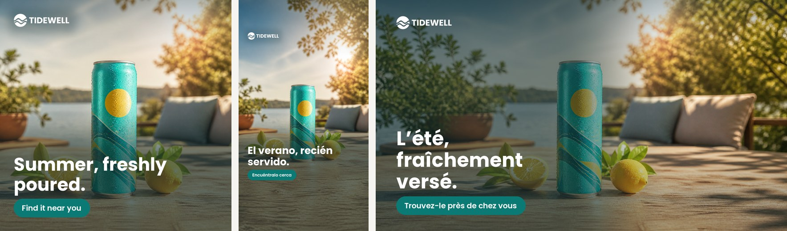
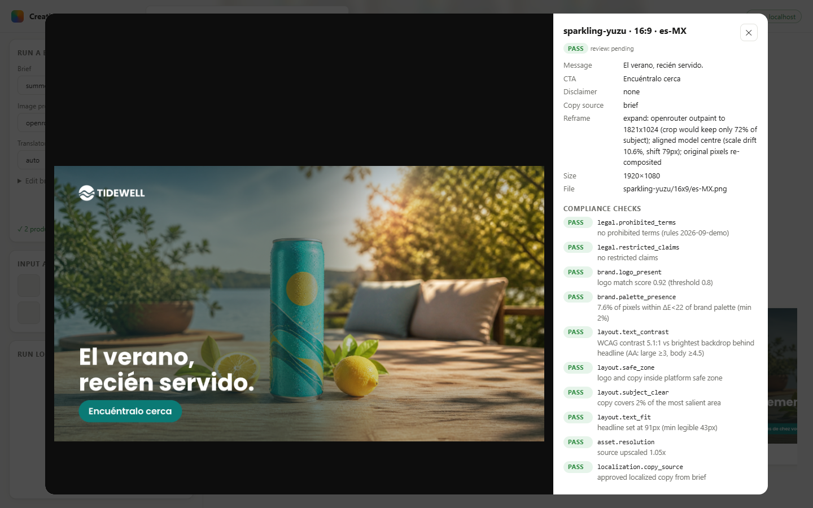
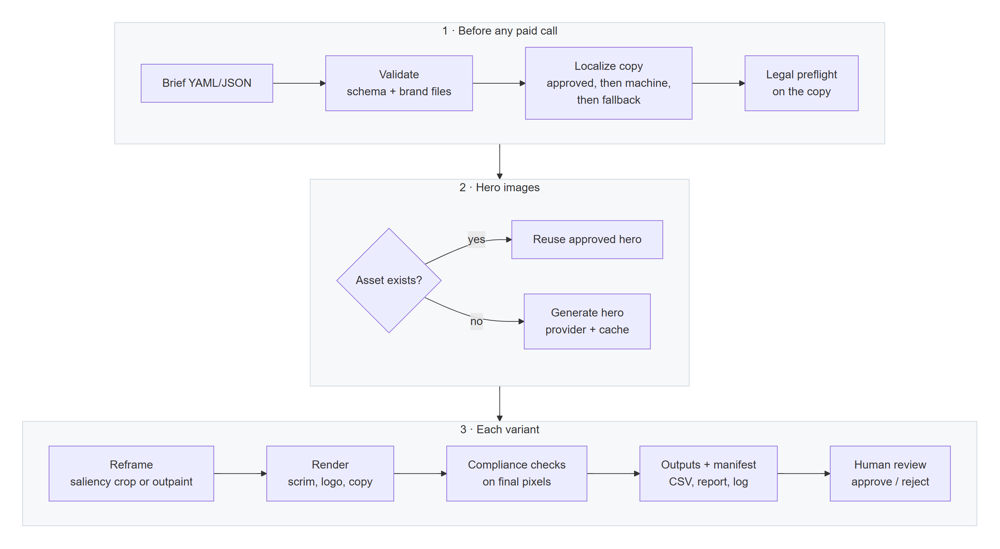

# Creative Automation Pipeline

A proof of concept that turns a campaign brief into localized social ad variants: every product in every aspect ratio for every market. It reuses approved assets, generates the ones that are missing with GenAI, and checks each output for brand and legal compliance before anyone reviews it.



**Live showcase (static, read-only):** `https://www.erronjason.com/creative-automation-pipeline/`
**Demo video:** _link_

---

## Quick start (about 90 seconds, no API keys)

Requires Python 3.10+.

```bash
git clone https://github.com/erronjason/creative-automation-pipeline.git
cd creative-automation-pipeline
python -m venv .venv && source .venv/bin/activate      # Windows: .venv\Scripts\activate
pip install -e .

cap demo     # runs both example briefs offline and opens the HTML report
cap serve    # local web UI at http://127.0.0.1:8765
```

`cap demo` uses the built-in **mock provider**. It is deterministic, needs no network or key, and watermarks its output as `MOCK RENDER`. That way every reviewer can run the full pipeline, and the tests never depend on a paid API.

**Using real GenAI:**

```bash
cp .env.example .env          # add OPENAI_API_KEY=... or OPENROUTER_API_KEY=...
cap providers                 # confirms which providers are configured
cap run briefs/summer-refresh.yaml --provider openai --open
cap run briefs/summer-refresh.yaml --provider openrouter --open   # one OpenRouter key, many image models
```

With a key present, locales that have no approved copy are also machine-translated (and flagged for regional review).

---

## Requirements coverage

| Requirement | Where / how |
|---|---|
| Brief with ≥2 products, region/market, audience, message | `briefs/*.yaml` (YAML or JSON), validated by a strict schema in `src/cap/brief.py`. Unknown fields are errors, so typos never pass silently. |
| Accept input assets and reuse them | `assets/<product-id>/hero.*`, or an explicit path in the brief. Assets are read through a storage interface (local folder or `s3://`). Upload or replace them in the web UI. |
| Generate missing assets with GenAI | `src/cap/providers/`: OpenAI GPT Image, OpenRouter (any image model behind one key), Adobe Firefly Services v3 (implemented to spec), mock (offline). |
| At least 3 aspect ratios | 1:1 (1080×1080), 9:16 (1080×1920), 16:9 (1920×1080). 4:5 is also supported. |
| Campaign message on the final post, localized | Brand fonts, auto-fit typography, CTA and disclaimer, inside platform safe zones. Uses approved per-locale copy, falling back to machine translation. |
| Runs locally | CLI (`cap`) and a local web UI (`cap serve`), both driven by the same pipeline. |
| Outputs organized by product and aspect ratio | `output/<campaign>/<product>/<ratio>/<locale>.png` |
| README | This file. |
| _Bonus:_ brand compliance | Logo detected in the final pixels, brand palette presence, WCAG text contrast, safe zones, text fit, source resolution. |
| _Bonus:_ legal checks | Prohibited terms (fail) and restricted claims (warn), layered global → language → locale, maintained as data in `legal/prohibited_words.yaml`. |
| _Bonus:_ logging and reporting | Structured `events.jsonl`, `manifest.json`, `variants.csv`, and a self-contained `report.html` per run. The same viewer is exported as the static showcase. |

---

## Example input → output

Every field a brief accepts is documented in [`docs/brief-reference.yaml`](docs/brief-reference.yaml), an annotated example that a test keeps complete, and in the JSON Schema from `cap schema brief`.

**Input** (`briefs/summer-refresh.yaml`, abridged):

```yaml
campaign:
  id: summer-refresh-2026
  brand: ../brand/tidewell/brand.yaml
  message: Summer, freshly poured.
  cta: Find it near you
target:
  region: North America
  audience: Active adults 25-40 who prefer low-sugar drinks and weekend outdoor plans
  markets:
    - { code: US, locale: en-US }
    - { code: MX, locale: es-MX }
    - { code: CA-QC, locale: fr-CA }   # no approved copy: machine-translated or flagged
products:
  - id: sparkling-yuzu               # if assets/sparkling-yuzu/hero.* exists -> reused; otherwise generated
    name: Tidewell Sparkling Yuzu
    description: slim teal aluminum can of lightly sparkling yuzu citrus water
  - id: cold-brew-tonic              # no asset                               -> generated
    name: Tidewell Cold Brew Tonic
    description: tall clear glass bottle of cold brew coffee with tonic
aspect_ratios: ["1:1", "9:16", "16:9"]
localized_copy:
  es-MX: { message: "El verano, recién servido.", cta: "Encuéntralo cerca" }
```

**Output** (2 products × 3 ratios × 3 locales = 18 posts):

```
output/summer-refresh-2026/
├── sparkling-yuzu/
│   ├── _source/hero.png          # the hero every variant was derived from
│   ├── 1x1/  en-US.png  es-MX.png  fr-CA.png
│   ├── 9x16/ en-US.png  es-MX.png  fr-CA.png
│   └── 16x9/ en-US.png  es-MX.png  fr-CA.png
├── cold-brew-tonic/ …            # same layout
├── manifest.json                 # every variant: copy, reframe method, checks, status, review state
├── variants.csv                  # flat export keyed by variant_id, for joining with ad performance data
├── events.jsonl                  # structured run log
└── report.html                   # self-contained visual report (opens from disk)
```

**Terminal** (a real cold run: no cache, no sample assets, both heroes generated live through OpenRouter):

```
$ cap run briefs/summer-refresh.yaml --provider openrouter
 validate brief 'summer-refresh-2026' OK: 2 products × 3 ratios × 3 locales
 localize fr-CA: machine-translated
   assets sparkling-yuzu: no asset found, generating with openrouter…
   assets cold-brew-tonic: no asset found, generating with openrouter…
   assets sparkling-yuzu: hero generated
   assets cold-brew-tonic: hero generated
  reframe sparkling-yuzu 1:1: resize
  reframe cold-brew-tonic 1:1: resize
  reframe cold-brew-tonic 9:16: expand
  reframe sparkling-yuzu 9:16: expand
  reframe sparkling-yuzu 16:9: expand
  reframe cold-brew-tonic 16:9: expand
     done 18 variants: 6 pass, 12 warn, 0 fail in 99.3s
         Summer Refresh 2026 · 18 variants         
┌─────────────────┬───────┬───────┬───────┬───────┐
│ product         │ ratio │ en-US │ es-MX │ fr-CA │
├─────────────────┼───────┼───────┼───────┼───────┤
│ cold-brew-tonic │ 1:1   │ warn  │ warn  │ warn  │
│ cold-brew-tonic │ 9:16  │ pass  │ pass  │ warn  │
│ cold-brew-tonic │ 16:9  │ pass  │ pass  │ warn  │
│ sparkling-yuzu  │ 1:1   │ warn  │ warn  │ warn  │
│ sparkling-yuzu  │ 9:16  │ warn  │ warn  │ warn  │
│ sparkling-yuzu  │ 16:9  │ pass  │ pass  │ warn  │
└─────────────────┴───────┴───────┴───────┴───────┘
heroes reused 0 / generated 2 · GenAI calls 6 · cache hits 0 · est. $0.08 (saved
$0.00) · 99.3s
report  output\summer-refresh-2026\report.html
```

A second run of the same brief makes **zero** GenAI calls, because every generated or outpainted image comes from the content-addressed cache.

`briefs/compliance-demo.yaml` is deliberately bad. Its copy says "guaranteed" and "garantiert" and makes a "best" claim, and it uses a long German headline. It shows the guardrails at work: all 16 variants fail the legal check, with the offending term named on each one.



---

## How it works



<sub>Diagram source: [`docs/pipeline.mmd`](docs/pipeline.mmd) (Mermaid). It is shipped as an image so it renders everywhere.</sub>

| Module | Responsibility |
|---|---|
| `brief.py`, `brand.py` | Validated contracts for campaign briefs and brand guidelines |
| `providers/` | `ImageProvider` interface (`generate`, `expand`) plus capability flags, rate limiting, retries. Adapters: OpenAI, OpenRouter, Firefly, mock |
| `imaging/saliency.py` | Spectral-residual saliency (finds the product without an ML model) and best-crop search |
| `imaging/reframe.py` | Resize, content-aware crop, or GenAI outpaint, chosen per variant |
| `imaging/align.py` | Registers an outpaint's redrawn centre to the source and matches margin colour at the seam |
| `imaging/render.py` | Layout, adaptive scrim, logo variant and backing plate, auto-fit typography, RTL-aware |
| `compliance/` | Legal copy rules and visual checks on the rendered output |
| `localize.py` | Copy resolution with provenance (`brief` / `machine` / `fallback`) |
| `pipeline.py` | Orchestration, parallelism, caching, manifest, fallbacks |
| `storage.py` | Local and S3 storage behind one interface |
| `cli.py`, `server.py`, `web/` | CLI, local FastAPI UI, and one no-build front end reused for the report and showcase |

---

## Key design decisions

1. **The brief is a validated contract.** The schema is strict, and unknown keys, bad slugs and unsupported ratios are errors. Brand files and legal copy are checked **before** any paid API call. A typo costs milliseconds, not a batch of image generations.

2. **Providers are behind an interface with capability flags.** The pipeline asks "can this provider outpaint?" rather than special-casing vendors. Adding Gemini or an internal model means adding one file. The **mock provider** makes the repo runnable by anyone and the test suite hermetic.

3. **One master hero per product, derived to every ratio.** Generating each ratio separately would triple cost and render the product differently in each format, which is a brand consistency problem. Instead, one hero is reused or generated and then reframed.

4. **Reframing is cost-aware.** In `auto` mode the pipeline first computes the best content-aware crop. If that crop keeps at least 85% of the subject's saliency, it crops, which is free and instant. Otherwise it pays for an outpaint (OpenAI edits with a mask, OpenRouter with a reference layout, or Firefly Generative Expand). After outpainting, the model's output is registered to the source and colour-matched at the seam, and then **the original pixels are composited back over it**, so an approved packshot is never subtly redrawn. If an outpaint fails, the pipeline logs it and falls back to cropping.

5. **The model never renders text.** Prompts forbid text and logos. All copy is set with brand fonts in code. That keeps typography on brand, makes localization and legal review deterministic, and avoids garbled AI lettering.

6. **Legibility is measured, not assumed.** Layout is computed first. Then a gradient scrim is fitted adaptively: its opacity rises only until the headline reaches WCAG 4.5:1 contrast against the brightest pixels actually behind it. On landscape formats, copy goes on the side with less subject saliency. 9:16 reserves the top and bottom zones that platform UI covers.

7. **Localization has provenance.** Approved transcreation in the brief always wins. Machine translation (with brand-voice guidance) and source-language fallback both work, but they are **flagged** on every affected variant. Machine output is never silently treated as approved.

8. **Compliance flags; humans decide.** Checks run on the final pixels. The logo detector searches the rendered image instead of trusting the renderer's coordinates. Results are `pass`/`warn`/`fail` with evidence attached. Nothing is silently dropped. `--strict` turns failures into a non-zero exit code for CI gates. Legal rules are data owned by Legal, not code.

9. **Everything that costs money is cached by content hash** (provider, model, prompt, size, input image). Rerunning after a copy change re-renders overlays in seconds for $0. The report shows estimated spend and savings.

10. **The manifest doubles as the analytics foundation.** Every variant has a stable ID and tags: product, market, locale, ratio, asset source, reframe method, copy source. `variants.csv` joins directly to ad-platform exports to learn which creative choices drive CTR and conversion.

11. **Review is built in and safe across reruns.** You can approve or reject variants in the UI (keys `A`/`R`, arrows to browse). On a rerun, an approval carries over **only if the image bytes are unchanged**. A changed image goes back to `pending`. A partial rerun (`--product`, `--ratio`, `--locale`) merges into the existing manifest instead of replacing it, so the rest of the campaign and its approvals stay put; if the brief, provider or model changed, the untouched variants are not carried over, and the run says so.

12. **Degrade, don't die.** A failed translation, a failed outpaint, or a missing referenced asset each becomes a recorded warning with a fallback, not a crashed batch. Transient API errors (429/5xx) are retried with backoff. 4xx errors fail fast with the provider's message. Firefly's documented 4 req/min org limit is enforced client-side.

13. **Secrets stay server-side.** The web UI is a thin FastAPI layer bound to `127.0.0.1`. It rejects requests with a foreign `Host` header (DNS rebinding) and cross-origin writes, so a web page in your browser cannot drive it; set `CAP_ALLOWED_HOSTS` to add hostnames you reach it by. Keys live in `.env` and never reach the browser. The GitHub Pages showcase is a static export with no keys at all.

---

## Compliance checks

| Check | Category | Fails / warns when |
|---|---|---|
| `legal.prohibited_terms` | legal | copy contains a prohibited term for that locale (**fail**) |
| `legal.restricted_claims` | legal | copy makes a claim needing substantiation (**warn**) |
| `brand.logo_present` | brand | multi-scale edge template match on the final image scores below 0.80 (**fail**). Calibrated: present ≥0.87 (lowest of 34 real generated variants), absent ≤0.70 |
| `brand.palette_presence` | brand | under 2% of pixels within ΔE 22 of the brand primary/secondary/accent (**warn**) |
| `layout.text_contrast` | layout | headline contrast below 4.5:1 (**warn**) or below 3:1 (**fail**) |
| `layout.safe_zone` | layout | logo or copy outside the platform safe zone (**fail**) |
| `layout.subject_clear` | layout | copy covers more than 15% of the most salient area, i.e. the product (**warn**) |
| `layout.text_fit` | layout | headline truncated (**fail**) or at minimum size (**warn**) |
| `asset.resolution` | asset | source upscaled more than 2× (**warn**) |
| `localization.copy_source` | localization | copy is machine-translated or a source-language fallback (**warn**) |

---

## CLI

```
cap run BRIEF [--provider mock|openai|openrouter|firefly] [--reframe auto|crop|expand]
              [--translator auto|openai|openrouter|none] [--assets DIR|s3://…] [--output DIR|s3://…]
              [--product ID] [--ratio R] [--locale L] [--no-cache] [--strict] [--open]
cap validate BRIEF        # schema + legal preflight, no GenAI calls; exit 1 on invalid brief or legal failure
cap schema [brief|brand]  # JSON Schema of a brief or brand file (editor validation, tooling)
cap serve                 # web UI: pick/edit a brief, upload assets, run, review & approve
cap showcase DIR... --dest showcase    # static read-only export for GitHub Pages
cap providers             # which providers are configured
cap demo                  # run every example brief (mock provider by default)
```

### The CLI is the automation surface

Everything the web UI does is also a command, so the pipeline can run from a script, a scheduled job or CI today, before any agent or MCP integration exists:

- **It gates.** `cap run --strict` exits 2 if any variant fails compliance, and `cap validate` exits 1 on an invalid brief or a legal failure, so either can stop a pipeline step. There are no interactive prompts; everything is a flag or an environment variable.
- **It produces data, not just images.** Each run writes `manifest.json` (every variant with its checks, provenance and review state), `variants.csv` (keyed by variant id, for joining with ad performance data) and `events.jsonl` (the run log).
- **It describes itself.** `cap schema brief` prints the JSON Schema of a brief: what a script, an editor or an agent needs in order to build a valid one.
- **It works in place.** `--assets` and `--output` accept `s3://bucket/prefix`, and partial reruns (`--product`, `--ratio`, `--locale`) update the existing manifest instead of replacing it.

An MCP server, when there is one, would be a thin wrapper: each command maps to one tool (`validate` to a validate tool, `run` to a generate tool, `schema` to the tool's input schema). It is not built here.

## Configuration

Copy `.env.example` to `.env`. Everything is optional for the offline demo.

| Variable | Purpose |
|---|---|
| `OPENAI_API_KEY` | Enables the `openai` provider and machine translation |
| `OPENAI_IMAGE_MODEL` / `OPENAI_IMAGE_QUALITY` | Default `gpt-image-2` / `medium` |
| `OPENAI_TEXT_MODEL` | Translation model (default `gpt-5.6-luna`) |
| `OPENROUTER_API_KEY` | Enables the `openrouter` provider and machine translation through OpenRouter |
| `OPENROUTER_IMAGE_MODEL` / `OPENROUTER_IMAGE_QUALITY` | Default `openai/gpt-image-2` / unset (`quality` is only sent when set, since not every model accepts it) |
| `OPENROUTER_TEXT_MODEL` | Translation model (default `openai/gpt-5.6-luna`) |
| `FIREFLY_CLIENT_ID` / `FIREFLY_CLIENT_SECRET` | Enables the `firefly` provider (enterprise org credential) |
| `CAP_ALLOWED_HOSTS` | Extra hostnames `cap serve` accepts (comma-separated); loopback is always allowed |
| `*_EST_COST_PER_IMAGE` | Planning estimate shown in reports. OpenRouter runs report the billed `usage.cost` instead. |

Brand guidelines (`brand/<brand>/brand.yaml`) define the palette, logo variants for dark and light backgrounds, fonts, voice (fed to the translator), visual style (appended to prompts), and optional per-ratio safe zones.

## Project layout

```
briefs/            example campaign briefs
brand/tidewell/    fictional brand kit: brand.yaml, logos, Poppins (OFL)
assets/            input asset library (assets/<product-id>/hero.*)
legal/             prohibited / restricted terms by locale
src/cap/           the pipeline (see module table above)
tests/             hermetic test suite: no network, no keys
showcase/          static export deployed to GitHub Pages
scripts/           reproducible generator for the sample brand kit and packshot
```

## Testing

```bash
pip install -e ".[dev]"
pytest          # 73 tests, ~2 min; covers schema, legal, saliency, reframing, rendering,
                # compliance, provider HTTP contracts (mocked), S3 (moto), web API, end to end
ruff check src tests
```

CI runs the suite on Linux, macOS and Windows with Python 3.10 and 3.12, then runs `cap demo` as a smoke test.

---

## Assumptions and limitations

- **Firefly is implemented to the public v3 docs but not exercised live.** Firefly Services credentials are issued only to enterprise organizations, so the adapter is verified with mocked HTTP contracts. At a customer that has Firefly Services, switching is `--provider firefly` plus two env vars. Supported output sizes vary by model version; see `SIZES` in `providers/firefly.py`.
- **OpenRouter outpainting has no mask.** The Images API takes reference images but no mask, so `expand` sends the source centred on a canvas whose margins are a blurred edge-extension of it, and asks the model to replace those margins with real detail. The model may re-render the centre slightly; the original pixels are re-composited over it as usual, and a failed outpaint falls back to cropping. Aspect ratio is an enum there (no `4:5`), so results are cover-cropped from the nearest ratio. To keep seams invisible, `imaging/align.py` registers the model's centre to the source and matches margin colour at the seam before the original pixels are pasted back. Exercised live through OpenRouter (10 outpaints across two briefs, `openai/gpt-image-2`) and contract-tested with mocked HTTP. Output still varies per generation, so review the seams in the report.
- **The OpenAI GPT Image models require a verified OpenAI organization.** Outpainting uses the edits endpoint with a mask. If a model or size is rejected, the pipeline falls back to cropping and records why.
- **Saliency is classical, not semantic.** Spectral residual finds the visually dominant region, which is almost always the product in ad photography. For busy scenes, set `assets.focus: [x, y]` in the brief. A production system would use a segmentation model.
- **Logo detection is template matching**, calibrated for logos the pipeline places. It is robust to background and scale, but not to rotation or heavy stylization.
- **Brand palette presence is a proxy**, not a judgment of on-brand aesthetics.
- **Scripts:** Latin scripts ship with the example font. RTL layout is supported (right alignment, `direction=rtl`, libraqm shaping when available). CJK, Arabic and similar scripts need a font per script in the brand kit.
- **Copy length limits** come from the schema (message ≤120 characters). Very long localized headlines are auto-shrunk to a legible minimum and then flagged, not truncated silently.
- **Single-machine concurrency** (thread pool). Batch scale-out is described below.
- **Cost figures are estimates** from configurable per-image rates, not billing data.
- The **Tidewell** brand, logo and packshot are fictional and generated by `scripts/make_sample_assets.py`. The font is Poppins (SIL OFL).

---

## Path to production

| Concern | This PoC | Production |
|---|---|---|
| Image generation | Provider interface: OpenAI / mock / Firefly adapter | Firefly Services (commercially safe training, IP indemnification), **Custom Models** trained on the brand, Generative Expand for reframing |
| Templates and compositing | Code-rendered layout | Photoshop / InDesign APIs driving designer-owned templates, so creative teams own layouts without code changes |
| Asset storage | Local folder / S3 | AEM Assets as the DAM: approved packshots, rights metadata and expiry, with generated assets written back with lineage |
| Approvals | Approve/reject in the local UI | Workfront review workflows with regional approvers, SLAs and audit trail |
| Activation and insights | `variants.csv` keyed by variant ID | GenStudio for Performance Marketing or ad-platform APIs, with performance joined back to variant tags |
| Provenance | Manifest records the provider, model and prompt for every image | Content Credentials (C2PA) attached to every AI-assisted asset |
| Scale | Thread pool on one machine | Queue plus stateless workers, with per-provider rate limits as shared tokens; the manifest and cache move to shared storage |
| Governance | YAML legal lists | Legal-owned rule service per market, plus an LLM second opinion on claims routed to human legal review |

---

## How I used AI

The assignment invited AI-assisted work, so here is how I used it. I set the requirements, the architecture, the design principles above and the acceptance criteria. I used Claude as an implementation partner for drafting code, tests and documentation. I reviewed everything, ran it end to end, and inspected the rendered output visually.

Verification caught several real issues along the way, each fixed at the root:

- The first logo detector scored **1.0 on images with no logo**. Normalized correlation is unstable on flat regions. I added an edge-energy mask and calibrated the threshold against labeled positives and negatives (absent ≤0.70). The first calibration used smooth mock renders (present 0.92-0.98). On real generated photography a white logo over busy foliage fell to 0.71-0.76, a legitimate legibility problem, so the renderer now fits a soft backing plate behind the logo, the weakest one that clears 3:1 contrast and low edge clutter. Present scores across 34 real variants are now ≥0.87.
- The first layout **failed contrast on 15 of 18 variants**. The checks were right; the layout was wrong. That led to the adaptive scrim and saliency-aware copy placement.
- The mock outpaint mirrored the product into the margins. I switched it to edge replication.
- OpenAI canvas sizing rounded **down** to multiples of 16, which could crop the source. It now rounds up, with a regression test.

## License

MIT for code. Poppins is licensed under the SIL Open Font License (`brand/tidewell/fonts/OFL.txt`).
